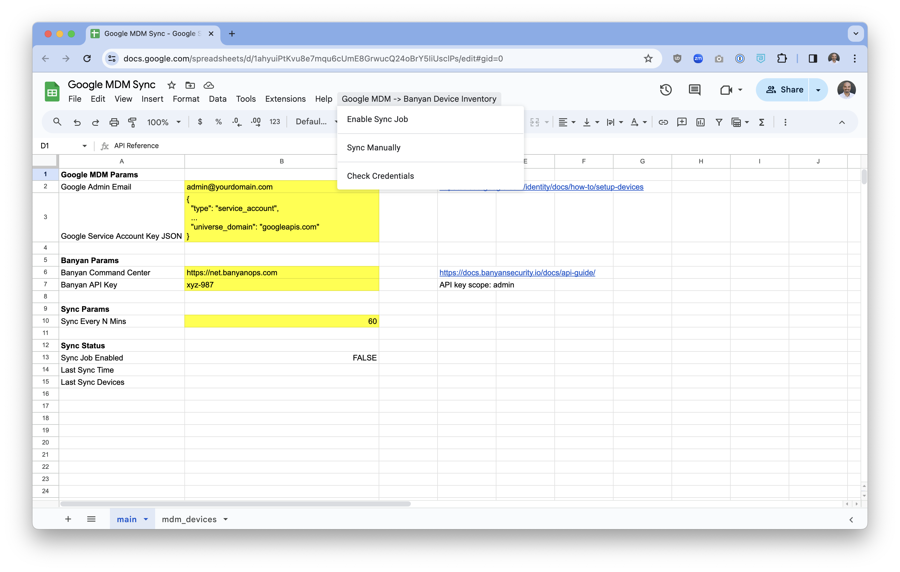

# Sync devices enrolled in Google MDM with Banyan device inventory

You can use Google Apps Script and the Banyan API to mark (mobile) devices in the Banyan device inventory as **managed** only if they are enrolled in Google MDM.

To get started click on the link below and make a copy of the reference spreadsheet in your Google account:

https://docs.google.com/spreadsheets/d/1ahyuiPtKvu8e7mqu6cUmE8GrwucQ24oBrY5IiUsclPs/copy

Open the Google Sheet, and populate the `Google MDM Params` and `Banyan Params` with your API credentials.

Then, use the dropdown to selected `Enable Sync Job`. The sync script will run every 60 minutes as a cron job, and sync devices enrolled in Google MDM with Banyan device inventory.

---

**Note:** This integration requires that you set up Google's [Cloud Identity Devices API](https://cloud.google.com/identity/docs/how-to/setup-devices).