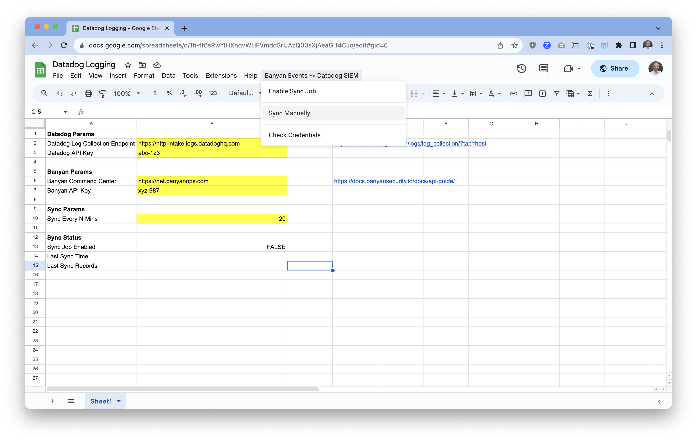

# Export Banyan events to Datadog using Google Sheets & Apps Script

You can use Google Apps Script to pull events from the Banyan API and sends them to DataDog, where you can see them in the Log Viewer.

To get started click on the link below and make a copy of the reference spreadsheet in your Google account:

https://docs.google.com/spreadsheets/d/1h-ff6sRwYlHXhqvWHFVmddSrUAzQ00sXjAeaGI14CJo/copy

Open the Google Sheet, and populate the `Datadog Params` and `Banyan Params` with your API credentials.

Then, use the dropdown to selected `Enable Sync Job`. The sync script will run every 10 minutes as a cron job, pull events and send them to Datadog.
